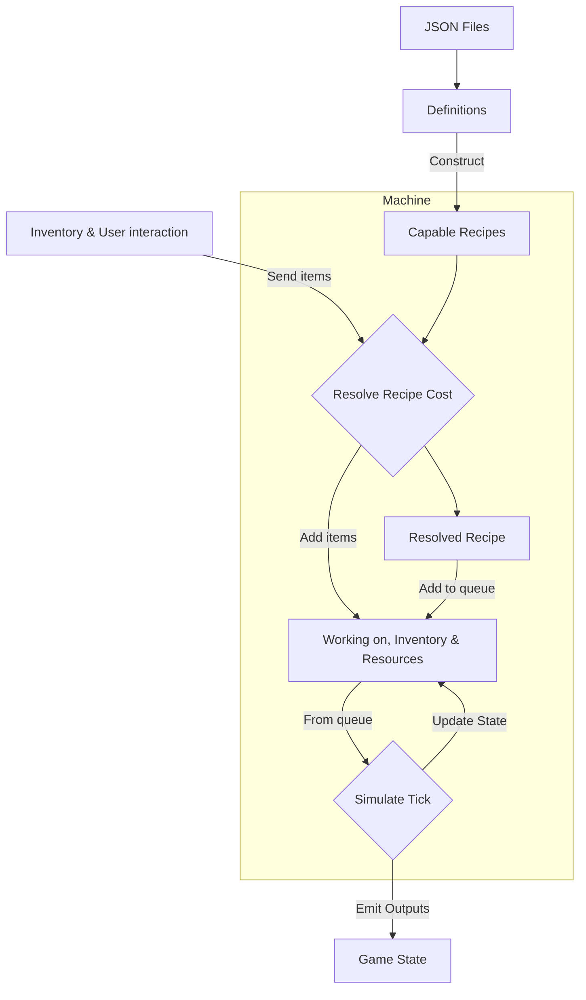

# Documentation
## Project overview

Entry point: `src/main/scripts.ts`

This project is a data-driven game simulation with a strict separation between:

- Game configuration data.
- Runtime simulation logic.
- User interface (optional / external).

The system is designed so that the core simulation can run headlessly, without any UI, allowing the user to switch between different html files while the simulation runs in the background from a universal script file.

It is possible to keep the state of the game when moving between different html files. That's why many of the classes and types can be serialized.

One of the big selling points of this game is the ability to connects machines together. There is two ways to do this: Processing lines and Factories.

### Processing line

Is a linear line of machine instances where the output of one machine routes to the input of the next machine. A machine line can only be built if every possible output can be routed without *ambiguity* (further details in the code). 

Processing lines allow recipes to be compressed into 1 and allow for basic automation. 

### Factories

Factories are much simpler but much more powerful. Here everything is defined and every route is built by the user, this allows a factory to contain super complex chains of machines that can preform any recipe chain. The most powerful thing about Factories is that they can be compiled into a single process making them super fast. 

Because factories act so similar to machines, they can used inside factories, creating a potentially infinite recursions of factories within factories that has not performance impact because pf the compilation. This has a limit: compiling a factory is not reversible, so the factory has to remember its internal graph of machines and recipes. This is the limiting factor because you will eventually run out of memory.

## Code Structure
Below is an overview of classes, types, modules and the higher level architecture of the codebase.

### Game Data
---
The folder **game-data** contains game configuration. This is the highest level of configuration in the project and defines the **content of the game** rather than its behavior.

All data defined here is:
- Constant.
- Deeply immutable at runtime.

#### Extraction and Items
These types form the Fixed Ontology of the game world.
They define the fundamental building blocks of the universe and cannot be extended or modified at runtime.

- **Items** describe the canonical object types that can exist. 

- **Extraction** describes the canonical extraction sources or extraction rules.

#### RecipeDef
Recipe definition describe what machines are capable of crafting. It goes together with MachineDef to construct a Machine.

#### MachineDef
This type describe the blueprint for the default machines in the game. Machines are not tied to the MachineDef type at all and custom machines can be built at runtime.

### Item
---
`{id:string, meta:JSONValue}`

Represents a specific item reference with optional metadata which is **null** by default.

### ItemEntry
---
`{id:string, meta:JSONValue, amount:number}`

Represents a specific item reference and quantity.

### Inventory "Class"
---
Inventory represents the universal item‑holding abstraction in the simulation. It provides a consistent interface for machines, factories, and player storage, and guarantees that all item movement respects global invariant.

### Input
---
`{amount:number, items:Item[]}`

Represents a single recipe input slot.
Usually used as an array of Inputs.

The reason for the array of **ItemInstances** is because multiple different items may satisfy a single input slot.

### CraftingOptions "Type"
---
Used to configure multiple crafting-related functions.

If different crafting functions are invoked with different **CraftingOptions**, they might disagree about the same state.
Correct usage requires that all related crafting operations share the same options instance.

### Machine "Class"
---
Responsible for simulating machines and recipe processing. It is not tied to **MachineDef** at all, **MachineDef** is a schematic for creating a **Machine**. 

Characteristics:
- Operates purely on data.
- Deterministic simulation.

This allows the same simulation to be run:
- Inside the main UI.
- In a separate HTML file.

### Recipe
---
`{input:Input[], output:ItemEntry[], processTimeSeconds:number}`

This type is context sensitive, it goes inside Machines and describe what they can craft. Recipes are entirely customizable but are usually derived from Recipe Definitions.

### ResolvedRecipe
---
`{inputs:ItemEntry[], outputs:ItemEntry[], time:number}`

ResolvedRecipe is an irreversible, atomic execution of a single recipe. Used as a recipe in process where items have already been consumed. 

## Technical notes:
The term **Item** is not entirely accurate as represents real life objects that might not fall under the category "item" such as liquids, gasses or energy. Resource is the more accurate term, but its still not perfect. Regardless **Item** is the chosen name.

Sometimes different function can disagree on the truth of the same state, in that case: Prediction functions are advisory; execution functions are authoritative. All execution functions should return enough data that any script from the outside can know exactly what happened. 

**resolveCraftingCosts** is a super important function, it is responsible for taking huge amount of data and turn that into a definitive set of items that can be used to satisfy the provided recipe.

### Diagram of the recipe and machine instance pipeline
---
Rectangle: value, Diamond: function. The diagram requires mermaid to be installed.

